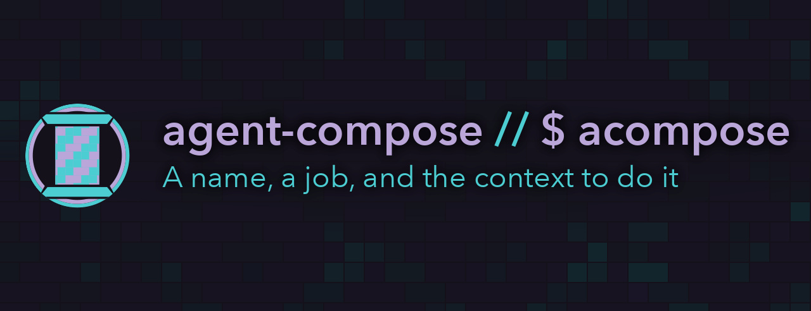
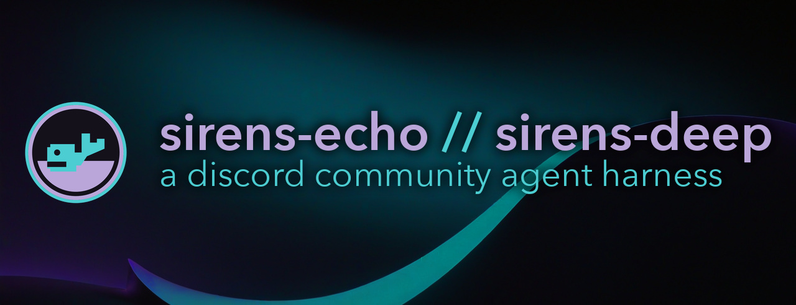
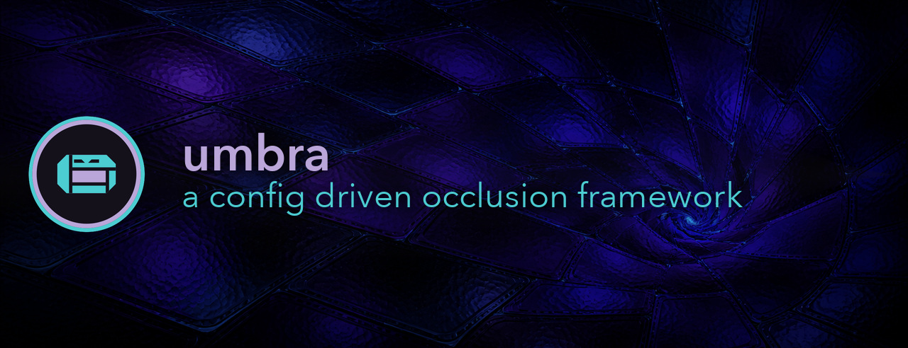

# coilysiren.me

my internet website

## Git workflow

Commit directly to `main` without asking for confirmation, including `git add`. Do not open pull requests unless explicitly asked.

Commit whenever a unit of work feels sufficiently complete, such as after fixing a bug, adding a feature, passing tests, or reaching any other natural stopping point. Don't wait for the user to ask.

## Status

## Project banners

## Local development

The site uses Node.js 24 LTS and pnpm 11. Corepack reads the exact pnpm release
from `package.json`, while `.node-version` keeps local development and hosted
builds on the same Node release.

Eleventy renders the site to ordinary static files in `dist/`. Core pages
render from server-produced HTML and locally served CSS and fonts, without a
framework runtime, hydration, or analytics. Optional embeds may load their own
resources after the core page is usable.

## Commands

Dev commands are declared in the [`justfile`](justfile). Run them as `just <verb>`, and run `just` alone to list every one.

- `just install` - install the locked dependency graph.
- `just dev` - clean, build, and serve Eleventy with live reload.
- `just test` - run formatting, lint, type, and unit checks.
- `just build` - create the production site in `dist/`.
- `just build-resume` - regenerate the PDF from the checked-in resume page in an isolated `uv` environment.
- `just image-build` - build the static staging image.
- `just image-smoke` - validate nginx inside the staging image.
- `just image-publish-check` - validate the trusted publisher script.
- `just test-e2e-ci` - serve the production build and run the Cypress smoke test.
- `just deps-outdated` - report dependency releases available upstream.

The dependency updater keeps Node types on the Node 24 runtime line and
TypeScript on 6.x until typescript-eslint supports TypeScript 7.

See [docs/static-generation.md](docs/static-generation.md) for the template,
content, asset, metadata, and output contracts.

## Hosting

Netlify remains the production host for the canonical
<https://coilysiren.me> site. The [staging image](docs/staging.md) supplies the
same static build to <https://website.coilysiren.me>. The
source repository publishes an immutable private image to Forgejo OCI.
`coilyco-bridge/deploy` owns its Kubernetes rollout, DNS, and TLS.

## See also

- [AGENTS.md](AGENTS.md) - agent-facing operating rules.
- [docs/FEATURES.md](docs/FEATURES.md) - inventory of what ships today.
- [justfile](justfile) - dev verbs.
- [.ward/ward.yaml](.ward/ward.yaml) - catalog metadata only. Agents route through ward, not bare `make` / `uv` / `python` / `npm` / `cargo` / `dotnet`.

Cross-reference convention from [coilyco-bridge/agentic-os-kai#313](https://github.com/coilyco-bridge/agentic-os-kai/issues/313).
